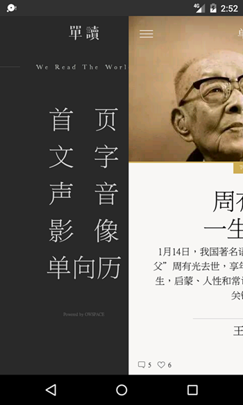
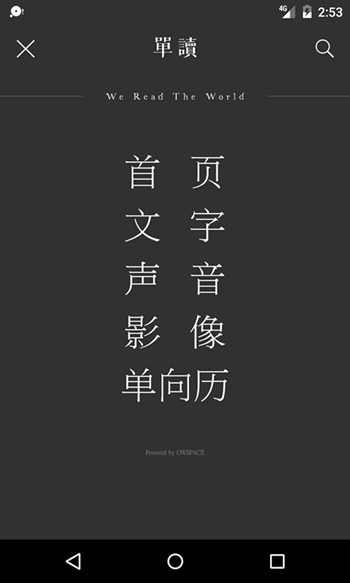
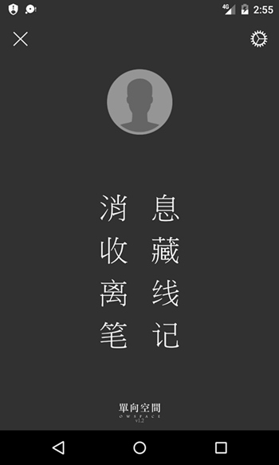
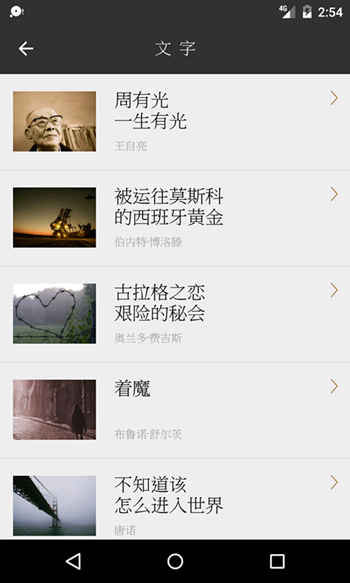
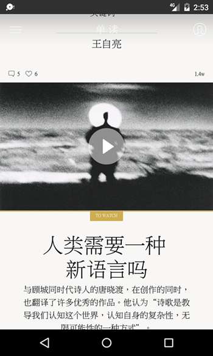
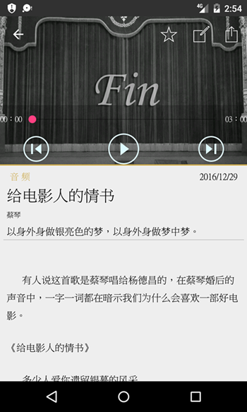
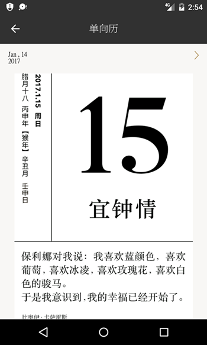
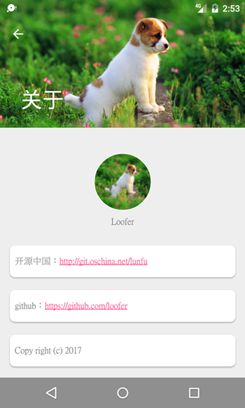

# 仿单读

根据单读api开发，基于Dagger2+RxJava+Retrofit开发，使用mvp模式开发~纯练手之作。

项目架构采用[Google Android Architecture Blueprints [beta]](https://github.com/googlesamples/android-architecture)

## API的使用声明

> 以下所有 API 均为非法获得，获取与共享之行为或有侵犯单读权益的嫌疑。若被告知需停止共享与使用，本人会及时删除此页面与整个项目。
请您了解相关情况，并遵守单读相关协议。

## 截屏

## 下载
> 需要模拟器运行请自行下载源码编译
[仅编译arm平台的apk](apk/WeRead.apk)

* 

# 鸣谢

[MVPArms](https://github.com/JessYanCoding/MVPArms)
其他热门开源项目

## 联系我
loofer#yeah.net (替换#为@)

## 许可证

    Copyright 2017 loofer

    Licensed under the Apache License, Version 2.0 (the "License");
    you may not use this file except in compliance with the License.
    You may obtain a copy of the License at

        http://www.apache.org/licenses/LICENSE-2.0

    Unless required by applicable law or agreed to in writing, software
    distributed under the License is distributed on an "AS IS" BASIS,
    WITHOUT WARRANTIES OR CONDITIONS OF ANY KIND, either express or implied.
    See the License for the specific language governing permissions and
    limitations under the License.
